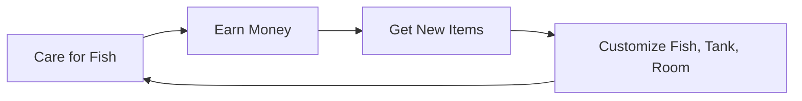

This is a game about a fish tank!

## 2.1. main loop overview 
1. Earn money by taking care of fish
2. Spend money in store and on gachapon
3. Get new and unique fish and new items to customize; these fish vary quite wildly
4. Customize fish and show off the new fish or items you've gotten
5. Repeat back to earn money by taking care of fish
## 2.2. earning money by increasing fish affection
- Players earn money slowly over time
- Players earn more money by interacting with and taking care of their fish → increases fish affection level
	- Feeding them and keeping them healthy
	- Walking them
	- Playing with them
- players earn more money by walking their fish